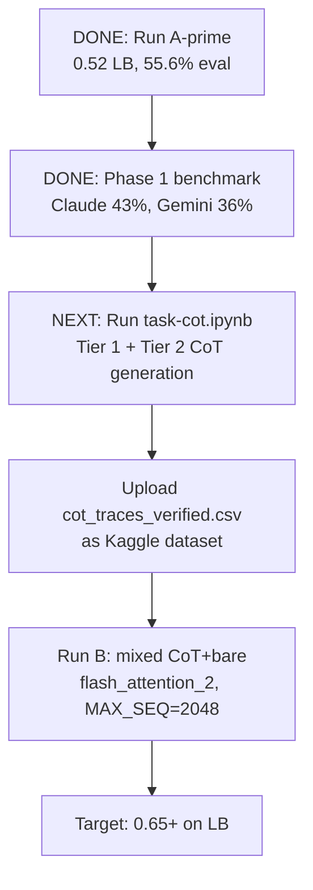

# Score Recovery and CoT Generation Pipeline

## Run A-prime Results (completed)

**LB Score: 0.52** | Eval: 55.6% (278/500)

| Family | Accuracy | Notes |
|---|---|---|
| numeral | 100% | Solved |
| unit_conversion | 100% | Solved |
| bit_manipulation | 42.9% | Needs CoT |
| gravity | 39.3% | Needs CoT |
| encryption | 34.9% | Needs CoT |
| equations | 15.9% | Hardest family |

Key finding: packing worked but **flash attention was missing** — TRL warned about cross-contamination between packed samples. Fixed in Run B notebook.

## Phase 1 Benchmark Results (completed)

500-row benchmark across 4 frontier models (answer-only):

| Model | Accuracy | Errors |
|---|---|---|
| Claude Opus 4.6 | 43.0% | 0 |
| Gemini 3.1 Pro | 36.2% | 218 |
| GPT-5.4 | 29.2% | 0 |
| DeepSeek-R1 | 0.0% | 455 (broken) |

**Our fine-tuned Nemotron (55.6%) beats all frontier models** on this benchmark. SFT on direct answers is effective for easy families; hard families need reasoning.

### Per-family winners (used for CoT model assignment):

| Family | Claude | Gemini | Assigned to |
|---|---|---|---|
| numeral | **100%** | 61.4% | Claude |
| encryption | **60.7%** | 58.3% | Claude |
| unit_conversion | **54.2%** | 42.2% | Claude |
| gravity | **16.9%** | 1.2% | Claude |
| bit_manipulation | 15.5% | **34.5%** | Gemini |
| equations | 10.8% | **19.3%** | Gemini |

## CoT Generation Strategy (tiered, multi-model)

### Tier 1 — Genuine CoT (highest quality)
Rows the assigned model got **right** in Phase 1. Model re-solves with full step-by-step reasoning. Keep only if extracted `\boxed{}` matches gold.

### Tier 2 — Correction-guided CoT
Rows the model got **wrong**. Provide the correct answer, ask model to generate reasoning that arrives at it. Prompt calls out "hidden traps." Keep only if `\boxed{}` matches gold.

Both tiers verify the final answer before accepting the trace. This prevents hallucinated reasoning from entering training data.

## Training Strategy: Mixed Single Run

**NOT** phased training (CoT → bare would cause catastrophic forgetting).

Single training run with mixed dataset:
- ~500 CoT rows: completion = `<think>\n{reasoning}\n</think>\n\boxed{answer}`
- ~8500 bare rows: completion = `\boxed{answer}`
- Packing handles the length difference naturally
- `MAX_SEQ_LENGTH=2048` (up from 1024) for CoT traces
- `flash_attention_2` prevents cross-contamination

## Current Execution Plan

## Key files

| File | Purpose |
|---|---|
| `task-cot.ipynb` | Phase 1 benchmark + Phase 2 tiered CoT generation |
| `improved-RunA-Notebook.ipynb` | Training notebook (Run B: flash attn, mixed CoT+bare) |
| `benchmark_outputs/cot_traces_verified.csv` | Exported CoT traces for training |
| `datasets/benchmark_sample_500.csv` | Fixed 500-row stratified sample |
